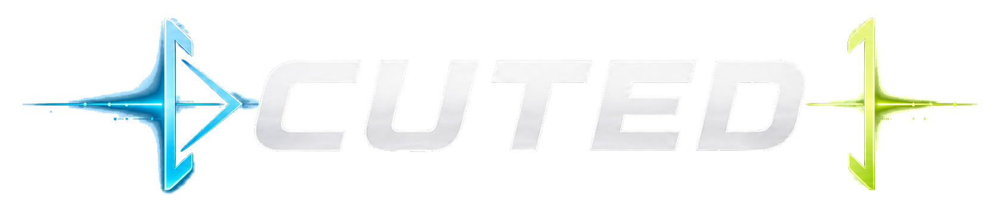
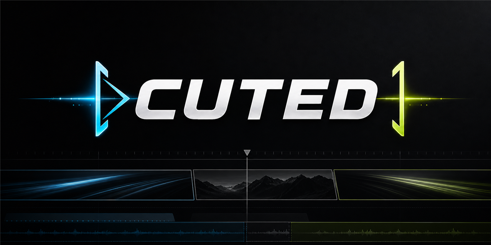
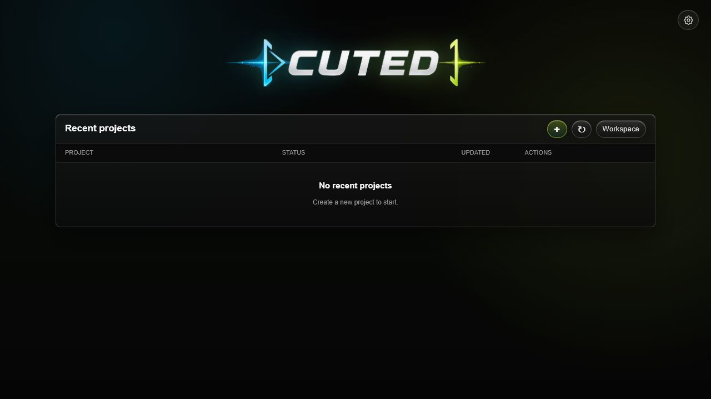
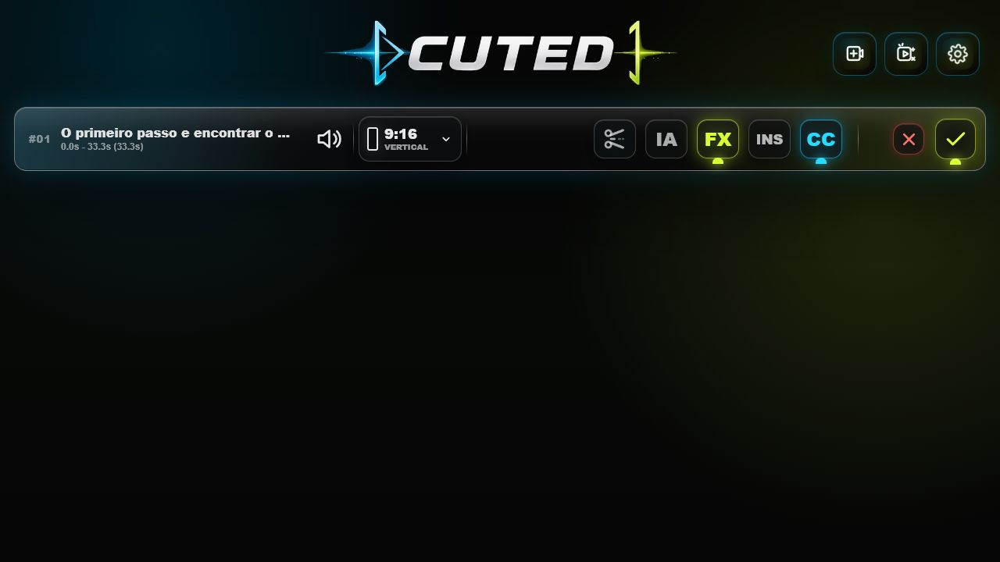

<p align="center">
  
</p>

<p align="center">
  Editor local para transformar videos longos em cortes prontos para redes sociais.
</p>

<p align="center">
  <a href="https://github.com/edubertin/CUTED/actions/workflows/ci.yml"></a>
  <a href="https://github.com/edubertin/CUTED/actions/workflows/codeql.yml"></a>
  <a href="LICENSE"></a>
  
</p>



## Interface

| Projetos locais | Editor |
| --- | --- |
|  |  |

As capturas usam um workspace vazio e um video sintetico criado para a
documentacao. Nenhuma midia ou projeto de usuario foi incluido.

## O Que E

CUTED e um aplicativo Windows local-first para encontrar bons momentos em
videos longos, preparar variacoes para diferentes plataformas e renderizar os
arquivos finais no proprio computador.

O projeto combina um motor Python, FFmpeg, uma interface local e recursos
opcionais de IA. Nao existe conta CUTED, banco de dados hospedado ou upload
automatico da sua biblioteca de videos.

## Recursos

- Importacao de videos locais e links do YouTube para uso autorizado.
- Sugestoes de cortes com duracao e limites de frase mais naturais.
- Timeline, trim, camera, efeitos, textos, imagens e bumpers por plataforma.
- Legendas em portugues e traducao para ingles sob demanda.
- Smart Camera local com OpenCV e Ultralytics YOLO.
- Render para TikTok, Shorts, Instagram, Facebook e YouTube.
- Projetos locais recuperaveis e fila de render em background.
- Diagnostico sanitizado para suporte, sem chaves ou conteudo de videos.

## Privacidade

Videos, previews, transcricoes e renders ficam no computador do usuario. Os
recursos que usam OpenAI sao opcionais e usam uma chave configurada pelo
proprio usuario. Quando esses recursos sao acionados, somente o material
necessario para aquela operacao e enviado a API escolhida.

Leia [PRIVACY.md](PRIVACY.md) para entender dados locais, integracoes opcionais,
retencao e diagnosticos.

## Estado Do Projeto

O codigo-fonte, o site e o primeiro instalador Windows estao em beta publico.
A pagina oficial esta em
[cuted-app.edubertin.chatgpt.site](https://cuted-app.edubertin.chatgpt.site/).
A prerelease oficial atual e
[CUTED 2026.07.17 Beta 1](https://github.com/edubertin/CUTED/releases/tag/v2026.07.17-beta.1),
distribuida gratuitamente pelo GitHub Releases com instalador e checksum.

O instalador ainda nao possui assinatura digital. Por isso, o Windows pode
exibir um aviso do SmartScreen. Essa limitacao e conhecida e nao deve ser
confundida com uma release estavel ou certificada.

Nao baixe executaveis enviados por terceiros. Releases oficiais aparecem
somente na pagina
[Releases](https://github.com/edubertin/CUTED/releases).

## Executar Pelo Codigo

Requisitos:

- Windows 10 ou 11;
- Python 3.12;
- FFmpeg e FFprobe;
- Node.js 24 para construir a timeline;
- chave OpenAI somente para recursos que usam a API.

```powershell
python -m pip install -r packaging/requirements-build.txt
python tools/cutted/scripts/cutted.py launch
```

O ambiente de desenvolvimento abre a interface em `127.0.0.1`. Esse servidor
aceita operacoes mutaveis apenas com a sessao local criada pelo proprio CUTED.

## Testes

```powershell
python -m unittest discover -s tests -p "test_*.py"
python -m py_compile tools/cutted/scripts/cutted.py
cd prototypes/live-timeline
npm ci
npm run build:lib
```

Os mesmos checks principais rodam no GitHub Actions em Windows.

## Build Windows

```powershell
powershell -ExecutionPolicy Bypass -File packaging/build.ps1
powershell -ExecutionPolicy Bypass -File packaging/smoke-test.ps1 `
  -AppDir "$env:LOCALAPPDATA\cuted-build\dist\CUTED"
powershell -ExecutionPolicy Bypass -File packaging/build-installer.ps1
```

Os artefatos sao gerados fora do repositorio, em
`%LOCALAPPDATA%\cuted-build`. Consulte
[packaging/PLANO-EXECUTAVEL-WINDOWS.md](packaging/PLANO-EXECUTAVEL-WINDOWS.md)
antes de distribuir um instalador.

## Arquitetura

```text
cuted.exe / Python
  -> servidor local em 127.0.0.1
  -> interface WebView2
  -> projetos em Documents/CUTED Workspace
  -> FFmpeg e visao local
  -> renders em Videos/CUTED Renders
  -> OpenAI opcional, com chave do usuario
```

O motor de referencia ainda vive em `tools/cutted/`. A separacao futura em
aplicativo desktop e pacotes esta documentada, mas nao e requisito para usar o
beta atual.

## Documentacao

- [Visao de produto](docs/product/PRD.md)
- [Indice tecnico](docs/README.md)
- [Contratos de dados](docs/architecture/DATA_CONTRACTS.md)
- [Pipeline de render](docs/architecture/RENDER_PIPELINE.md)
- [Matriz de regressao](docs/qa/REGRESSION_MATRIX.md)
- [Desenvolvimento local](docs/operations/LOCAL_DEV.md)
- [Checklist de release publico](docs/operations/PUBLIC_RELEASE_CHECKLIST.md)
- [Auditoria de publicacao de 2026-07-17](docs/operations/PUBLIC_RELEASE_AUDIT_2026-07-17.md)

## Contribuir E Reportar Problemas

Leia [CONTRIBUTING.md](CONTRIBUTING.md) antes de abrir um pull request. Bugs
podem ser relatados em Issues sem anexar videos, transcricoes, chaves, caminhos
privados ou payloads crus. Vulnerabilidades devem seguir [SECURITY.md](SECURITY.md).

## Licenca

O codigo do CUTED e distribuido sob
[GNU Affero General Public License v3.0 only](LICENSE). Essa escolha acompanha o uso
de Ultralytics YOLO no build atual. Dependencias e obrigacoes adicionais estao
em [THIRD_PARTY_NOTICES.md](THIRD_PARTY_NOTICES.md).

O escopo de copyright esta em [COPYRIGHT.md](COPYRIGHT.md). Assets visuais usam
`CC-BY-SA-4.0`; direitos de marca permanecem separados em [BRAND.md](BRAND.md).
