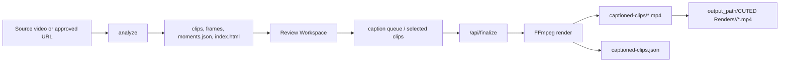

# Render Pipeline

## Overview

The current CUTED render pipeline is local-first and FFmpeg-based. The browser
workspace produces JSON state, and the local Python server turns that state into
final MP4 outputs.



## Commands

```powershell
python tools/cutted/scripts/cutted.py analyze "video.mp4" --out "samples/example" --preset tiktok --language pt
python tools/cutted/scripts/cutted.py serve --dir "samples/example" --port 8779
python tools/cutted/scripts/cutted.py caption-selected "samples/example/caption-queue.json" --out "samples/example/captioned-clips"
python tools/cutted/scripts/cutted.py render-selected "samples/example/selected-clips.json" --out "samples/example/final-clips"
```

## Processing Stages

1. Source preparation. YouTube imports should prefer a local high-quality source
   up to 1440p when available, then fall back through lower qualities.
2. Transcript loading or transcription.
3. Highlight candidate selection.
4. Candidate diversity guardrails.
5. Preview clip render from the best available source.
6. Frame extraction.
7. HTML review workspace generation.
8. Browser edit state collection.
9. Final queue submission to `/api/finalize`.
10. Caption, camera, effect, and overlay filter construction.
11. Final MP4 render.
12. Final MP4 copy to the configured render destination when available.
13. Output manifest update.

## Output Locations

`captioned-clips/` is the technical workspace output. It may include MP4
previews, subtitle files, and manifests required by the local review UI.

When an import has `output_path` in `import-request.json`, `/api/finalize`
copies only the final MP4 files to:

```text
<output_path>/CUTED Renders/<import-folder>/
```

The UI may keep using the workspace MP4 for browser preview, but the user-facing
final file is the manifest/response `final_file` or `local_file` path.

## Import Quality

The analyzer materializes YouTube sources into `_source/source.*` when possible
instead of relying on a low-resolution direct stream. The default selector
prefers up to 1440p and H.264 video with M4A audio when available, then falls
back through compatible 1080p and best available formats. Operators can override
the selector with `CUTED_YOUTUBE_RENDER_FORMAT` for debugging.

`_source/source-metadata.json` records the selected format, whether the render
source is local or a remote fallback, and FFprobe diagnostics when available.
This is the QA checkpoint for soft Smart Camera exports: vertical 1080x1920
renders and zoomed camera paths need substantially more source resolution than
the old 360p/480p stream fallback provided.

## Filter Order

The renderer should preserve this conceptual order:

1. Input trim.
2. Platform crop/scale.
3. Camera reframe.
4. Captions/subtitles.
5. Effect.
6. Text overlays.
7. Image overlays.
8. Output encode.

Actual FFmpeg filter graph implementation may split and concatenate sections
for camera segments.

## Camera Preview Parity

Camera reframing is stored as a three-part sequence for the beginning, middle,
and end of the adjusted clip. The browser preview should derive the active
camera segment from the current playback time inside the trimmed range, using
the same third-split rule as the FFmpeg filter graph.

The browser should not use independent infinite CSS camera animations because
they drift from the rendered MP4. Dynamic presets such as `alternate` and
`jump-cut` should be calculated from video time so seek, play, and final render
show the same framing intent.

## Camera Path

The browser emits `camera_path` with finalization payloads. In simple mode it
is derived from the current manual `camera` sequence. In advanced mode the user
can add timeline keyframes at the current playhead; that explicit path is saved
per platform and becomes the render source of truth. Future automatic
reframing should write explicit keyframes into the same track. The renderer
should prefer explicit `camera_path` data when present, while keeping legacy
`camera` sequence rendering supported for older queue files.

Manual camera keyframes may include the legacy preset `key` and `strength`.
Those frames render through the same FFmpeg crop/scale presets as the manual
camera controls. Arbitrary keyframes without a preset key render using their
`x`, `y`, and `zoom` values.

The UI direction is Smart Camera first. Beginning/middle/end controls and
manual keyframe editing should remain available as an advanced fallback, but
the default camera workflow should ask for the user's framing intent and
generate a `camera_path` with computer vision.

## Auto Camera Analysis

The local gallery server exposes `/api/camera/analyze` for optional OpenCV
face-based reframing. The endpoint reads the selected clip, respects the
current trim start and adjusted duration, samples frames, detects faces, and
returns explicit `camera_path` keyframes.

The current Smart Camera analyzer can also run a local hybrid Vision Engine.
When the optional `ultralytics` package and configured YOLO model are available,
the analyzer adds person detections to the OpenCV face detections before
building local safety frames and AI Director context. This improves scenes where
people are visible but faces are side-on, turned away, or too weak for Haar
cascades. If YOLO cannot load, the analyzer falls back to OpenCV without
blocking camera editing.

Supported smart modes:

- `auto-director`: default mode. Tracks the primary face and, when enough
  simultaneous faces are detected, inserts wider group/reaction framing without
  requiring the user to pick a manual multi-face preset. If faces approach the
  horizontal crop edge, it uses safe group framing to avoid cutting a speaker.
- `ai-director`: optional hosted layer for dynamic editorial framing. It may
  include punctual editorial cuts, but should not force every change to be a dry
  cut.
- `ai-director-group`: optional hosted layer biased toward group/podcast
  framing when multiple people are visible.
- `ai-director-speaker`: optional hosted layer biased toward the likely active
  speaker while keeping visible context inside the crop.
- `ai-director-reactions`: optional hosted layer biased toward reaction cuts
  and alternating visible people with pauses.
- `ai-director-cuts`: optional hosted layer biased toward dry editorial cuts
  between stable shot choices, with 2.5-4.5 second holds and no gradual pan
  intent. The payload includes scene-direction hints for primary faces,
  secondary/reaction windows, and group windows.

All AI Director modes run the local OpenCV analysis first, send compact
diagnostics, a few low-detail sampled frames, transcript context, an editorial
intent, the selected platform viewport, and the local Auto Director path to
OpenAI, then validate the returned `camera_path`. If OpenAI is unavailable or
the response is invalid, the endpoint falls back to the local Auto Director
path. The validated result is also checked against OpenCV multi-face detections
and the selected platform viewport so scenes with three visible people, or two
people at risk of being cropped, open to group-safe framing instead of holding a
close-up on only one face. After the model response, a dense local protection
pass scans OpenCV samples again and inserts mandatory keyframes when the active
crop would cut a reliable face or when a platform-specific group frame is
required. This keeps OpenAI in the editorial/director role while local detection
remains the source of truth for crop safety. When a vertical platform cannot fit
the detected group inside the crop even at the widest camera zoom, the protection
pass writes a `group-fit` frame. Final render treats that frame as a contained
foreground over a blurred full-frame background, which is intentionally
reversible by removing the `group-fit` source/`fit = contain` marker. The v19
safety fallback also forces group-fit when a second pass still finds multi-face
risk after dense protection, with extra attention to the final seconds of the
clip. Browser preview mirrors this composition with a muted synchronized
background video so the editor does not show raw black letterbox bars for
contained group shots.

AI Cuts post-processes the validated path with OpenCV scene roles. When a
secondary face is reliable, it emits a principal -> reaction -> principal pattern
instead of only spacing model keyframes. Group-risk frames still open to
`ai-director-cuts-group-safe`. If scene roles are too weak, AI Cuts falls back to
spacing validated model keyframes and marking their source as `ai-director-cuts`.
Wide group-risk frames may become `ai-director-cuts-group-fit` so the dry cut
lands on a full-group contained view instead of a cropped close-up.
Final render already treats each `camera_path` keyframe as a trimmed segment;
the browser preview should also hold these frames and disable CSS transition on
the video element instead of interpolating or visually panning between them.
- `follow-face`: tracks the primary face with smoothing, but also uses safe
  group framing when another detected face would be cut by the vertical crop.
- `stable-face`: creates one stable median crop for the detected face.
- `face-zoom`: tracks the primary face with a tighter zoom.
- `alternate-faces`: alternates smoothly between multiple detected faces when
  available. This remains available for compatibility.
- `cut-between-faces`: cuts between multiple detected faces when available.
  This remains available for compatibility.

If Auto Director or a multi-face compatibility mode cannot find enough
simultaneous faces, the endpoint falls back to the primary-face path instead of
failing the edit. The older
beginning/middle/end controls remain manual presets and are not treated as
OpenCV-aware detection modes.

The result is cached in `camera-analysis/` using the clip fingerprint, trim
window, platform, smart mode, and analysis version. If OpenCV is not installed,
the endpoint returns a user-safe install message and manual camera editing remains
available.

When `source_start_seconds` is provided and an import source can be resolved,
Smart Camera analyzes the original source first and falls back to the generated
preview clip only if source analysis cannot run or cannot find faces. This
keeps the existing clip workflow compatible while letting newer imports use
full source context.

Every analysis response should include `diagnostics` with the analyzed media
scope (`source` or `clip`), dimensions, sample count, detection count,
multi-face frame count, edge-risk frame count, detection timing range, and
produced keyframe count.
These diagnostics are the first QA layer for deciding whether a bad camera
result came from weak detection, a cropped/low-resolution analysis source, or
path generation.

AI Director diagnostics live under `diagnostics.ai_director` and should state
the selected intent, whether OpenAI was enabled, whether a fallback was used,
how many frames were sent, and a short summary when the model produced a valid
path. Camera diagnostics also record final keyframe count, maximum/average gap
between camera keyframes, protected keyframes, and remaining crop-risk frames so
QA can compare dense reframing quality between runs.

## Effects

The browser preview uses CSS filters and overlays, but final exports must use
FFmpeg filters with equivalent visible intent. Low non-zero intensities should
still produce a visible MP4 difference, because subtle pure noise can disappear
after H.264 compression. Regression checks should cover `light-grain`,
`old-film`, `vhs`, and `bw-old` individually.

## Platform Presets

```text
TikTok:    1080x1920
Shorts:    1080x1920
Instagram: 1080x1920
Facebook:  1080x1920
YouTube:   1920x1080
```

## Known Risk Areas

- Browser state and render state can diverge if finalization snapshots stale
  data.
- Running an old local server process after editing `cutted.py` can make a fix
  appear broken.
- Image overlays require local materialized assets before FFmpeg can compose
  them.
- PNG/WebP transparency depends on the overlay filter preserving alpha.
- Generated sample artifacts can dirty the git tree during QA.
- Hosted transcription can reject oversized audio uploads unless audio is
  compressed or chunked first.
- AI-selected candidate IDs can repeat the same timeline region unless
  deterministic diversity guardrails are applied after selection.

## Render Acceptance Criteria

- Text overlays visible in browser must render into final MP4.
- Image overlays visible in browser must render into final MP4.
- Per-platform edits must render with the correct platform dimensions.
- Captions must render after trim timing is normalized.
- Effects must render without removing captions or overlays.
- The output manifest must reflect every successful platform render.
