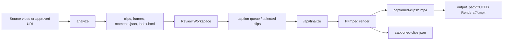

# Render Pipeline

## Overview

The current CUTED render pipeline is local-first and FFmpeg-based. The browser
workspace produces JSON state, and the local Python server turns that state into
final MP4 outputs.



## Commands

```powershell
python tools/cutted/scripts/cutted.py analyze "video.mp4" --out "samples/example" --preset tiktok --language pt
python tools/cutted/scripts/cutted.py serve --dir "samples/example" --port 8779
python tools/cutted/scripts/cutted.py caption-selected "samples/example/caption-queue.json" --out "samples/example/captioned-clips"
python tools/cutted/scripts/cutted.py render-selected "samples/example/selected-clips.json" --out "samples/example/final-clips"
```

## Processing Stages

1. Source preparation.
2. Transcript loading or transcription.
3. Highlight candidate selection.
4. Candidate diversity guardrails.
5. Preview clip render.
6. Frame extraction.
7. HTML review workspace generation.
8. Browser edit state collection.
9. Final queue submission to `/api/finalize`.
10. Caption, camera, effect, and overlay filter construction.
11. Final MP4 render.
12. Final MP4 copy to the configured render destination when available.
13. Output manifest update.

## Output Locations

`captioned-clips/` is the technical workspace output. It may include MP4
previews, subtitle files, and manifests required by the local review UI.

When an import has `output_path` in `import-request.json`, `/api/finalize`
copies only the final MP4 files to:

```text
<output_path>/CUTED Renders/<import-folder>/
```

The UI may keep using the workspace MP4 for browser preview, but the user-facing
final file is the manifest/response `final_file` or `local_file` path.

## Filter Order

The renderer should preserve this conceptual order:

1. Input trim.
2. Platform crop/scale.
3. Camera reframe.
4. Captions/subtitles.
5. Effect.
6. Text overlays.
7. Image overlays.
8. Output encode.

Actual FFmpeg filter graph implementation may split and concatenate sections
for camera segments.

## Effects

The browser preview uses CSS filters and overlays, but final exports must use
FFmpeg filters with equivalent visible intent. Low non-zero intensities should
still produce a visible MP4 difference, because subtle pure noise can disappear
after H.264 compression. Regression checks should cover `light-grain`,
`old-film`, `vhs`, and `bw-old` individually.

## Platform Presets

```text
TikTok:    1080x1920
Shorts:    1080x1920
Instagram: 1080x1920
Facebook:  1080x1920
YouTube:   1920x1080
```

## Known Risk Areas

- Browser state and render state can diverge if finalization snapshots stale
  data.
- Running an old local server process after editing `cutted.py` can make a fix
  appear broken.
- Image overlays require local materialized assets before FFmpeg can compose
  them.
- PNG/WebP transparency depends on the overlay filter preserving alpha.
- Generated sample artifacts can dirty the git tree during QA.
- Hosted transcription can reject oversized audio uploads unless audio is
  compressed or chunked first.
- AI-selected candidate IDs can repeat the same timeline region unless
  deterministic diversity guardrails are applied after selection.

## Render Acceptance Criteria

- Text overlays visible in browser must render into final MP4.
- Image overlays visible in browser must render into final MP4.
- Per-platform edits must render with the correct platform dimensions.
- Captions must render after trim timing is normalized.
- Effects must render without removing captions or overlays.
- The output manifest must reflect every successful platform render.
